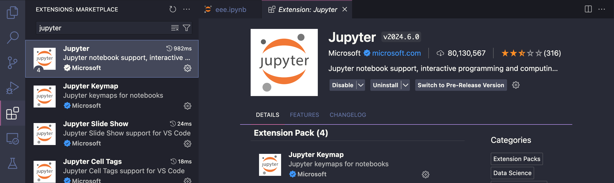
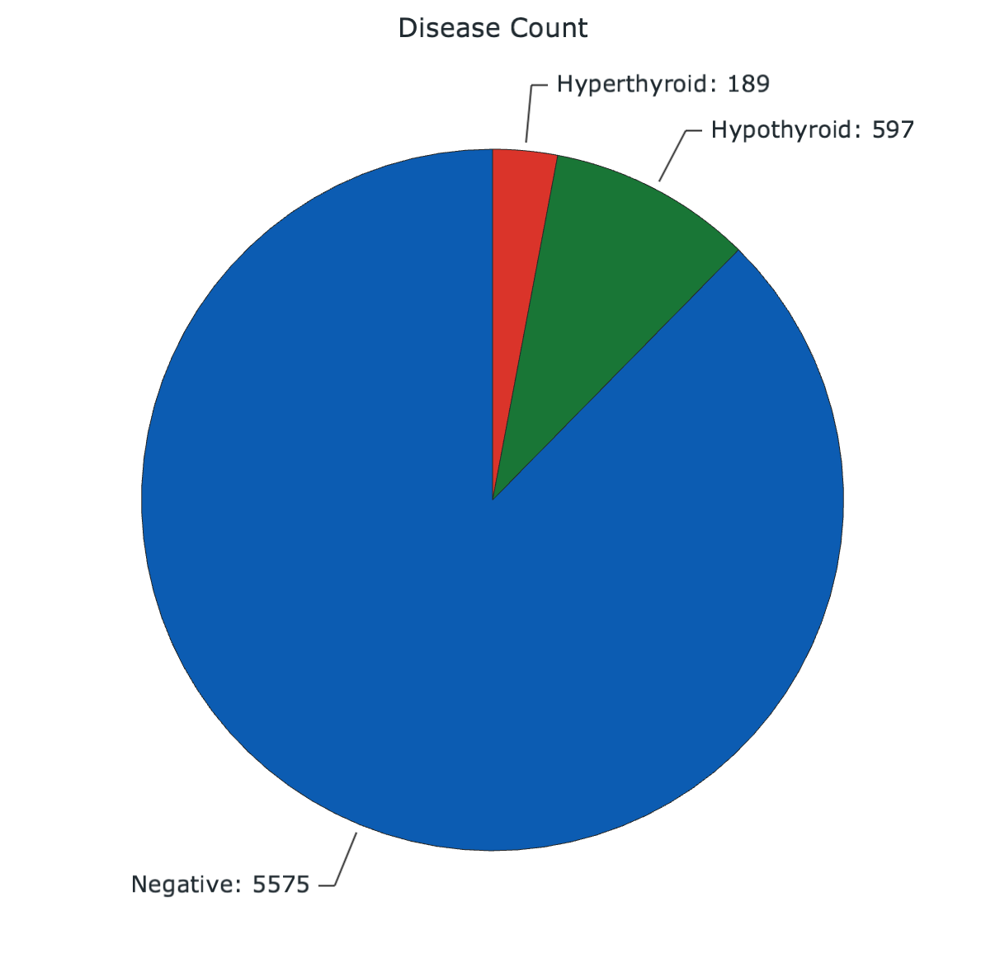
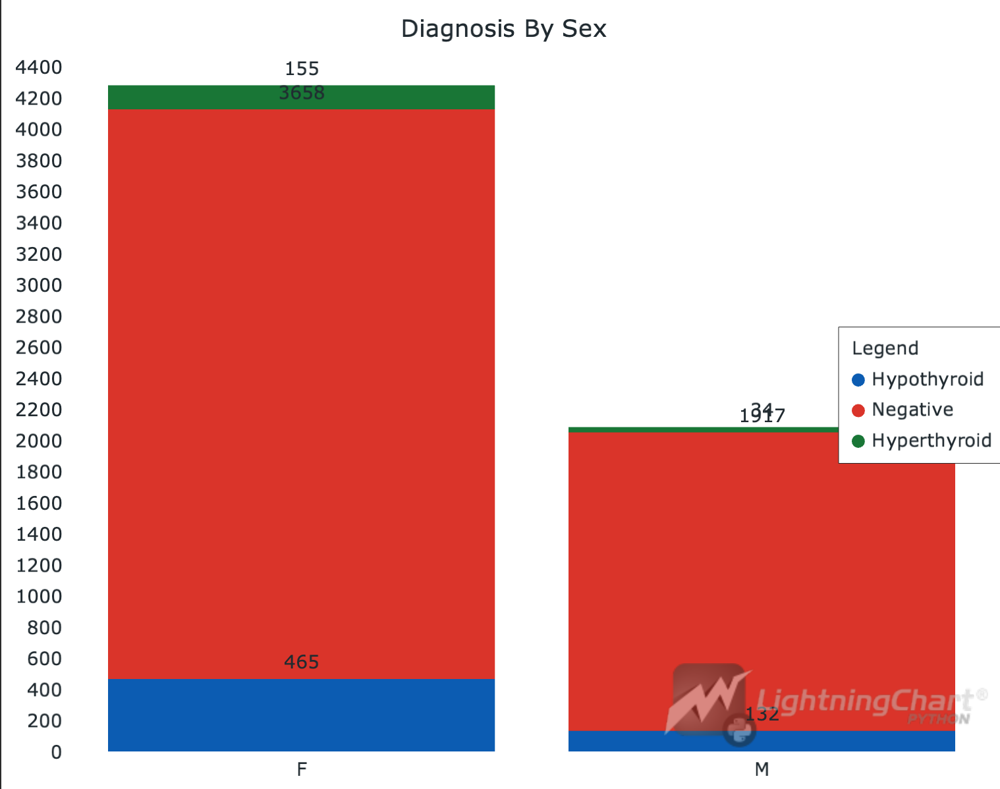
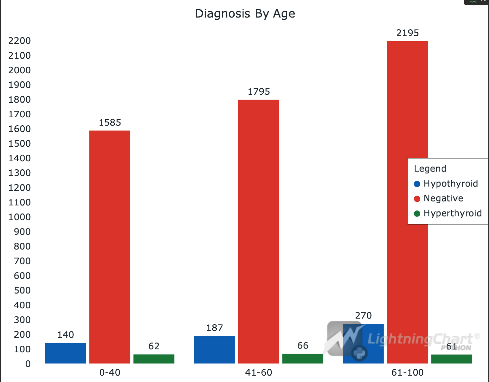
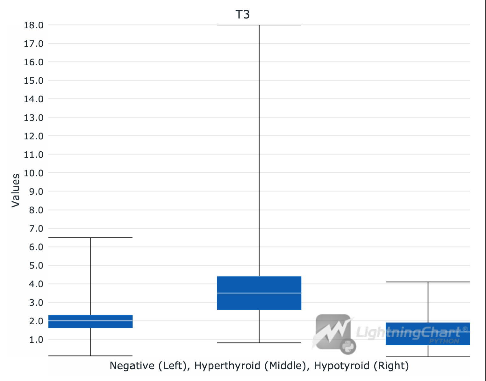
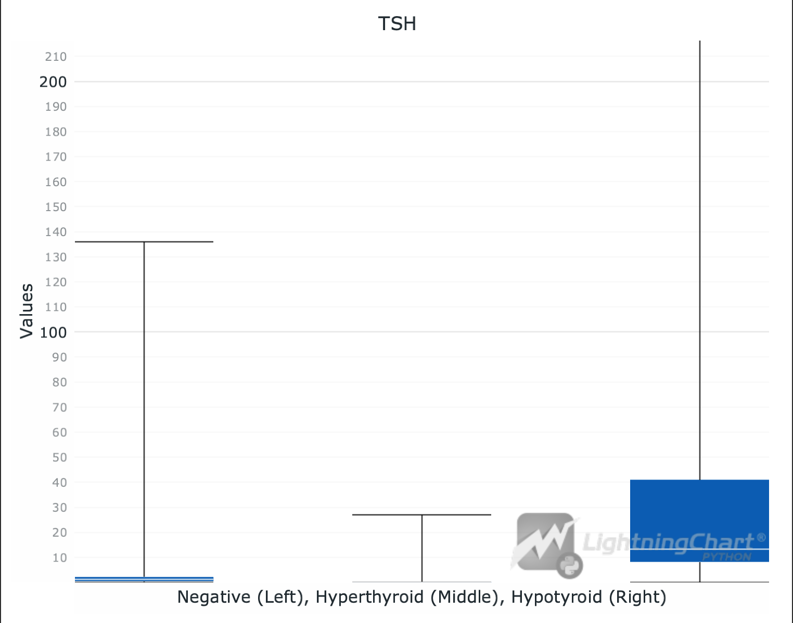
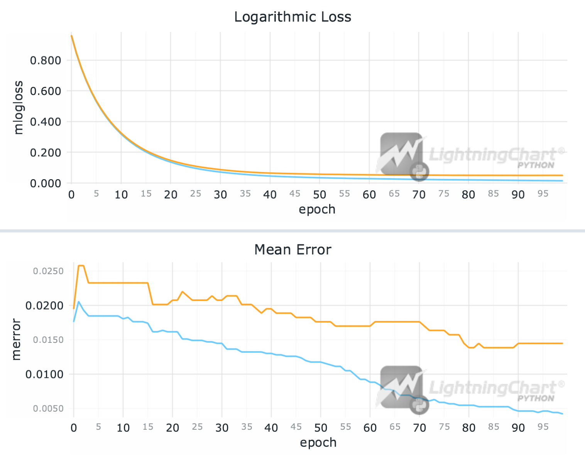
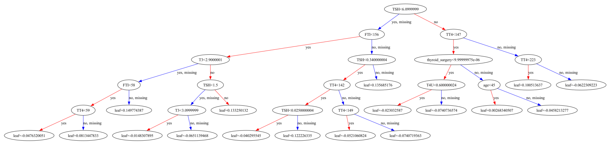
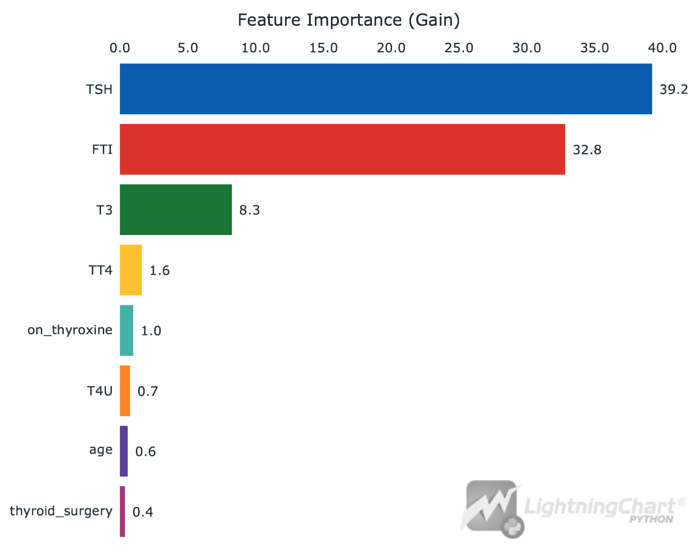

# hyroid disease analysis data application with LightningChart Python 
## Introduction
Thyroid is a small gland located in front of a human's neck. It produces hormones that affect a lot of organs in the body.

Two of the main thyroid diseases which we will analyze in this article will be:
- Hyperthyroidism, which happens when thyroid gland makes more thyroid hormones than your body needs
- Hypothyroidism, which happens when thyroid gland does not make enough thyroid hormones

#### Why is it important to track these diseases
As thyroid hormones affect almost all organs, thus thyroid diseases can affect heart rate, mood, metabolism, bone health and pregnancy.

### Datasets
There are numerous datasets, which you can find at different healthcare institution portals (e.g. [data.gov](https://catalog.data.gov/dataset?tags=thyroid)) or dataset-related sites (e.g. [kaggle.com](https://www.kaggle.com/datasets/emmanuelfwerr/thyroid-disease-data)).

In this project we will use the dataset "Thyroid Disease Data" from Kaggle, perform some basic analysis with different types of visualization. We will also create a model which will predict the patient outcomes.

## LightningChart Python
For this task we will use [LightningChart](https://lightningchart.com/python-charts/) library. It provides a wide range of tools for creating graphs that are also useful for thyroid disease prediction in Python. \
In this project, we will use:
1. - XY Chart ([Link to docs](https://lightningchart.com/python-charts/docs/charts/chart-xy/)) \
   *in combination with*
   - Line Series ([Link to docs](https://lightningchart.com/python-charts/docs/charts/chart-xy/#line-series))

2. 3D Chart ([Link to docs](https://lightningchart.com/python-charts/docs/charts/chart-3d/)), also with Point Series
3. Stacked Bar Chart ([Link to docs](https://lightningchart.com/python-charts/docs/charts/bar-chart/#stacked-bar-chart))
4. Grouped Bar Chart ([Link to docs](https://lightningchart.com/python-charts/docs/charts/bar-chart/#grouped-bar-chart))
5. Box Plots ([Link to docs](https://lightningchart.com/python-charts/docs/charts/box-plot/))
6. Pie Chart ([Link to docs](https://lightningchart.com/python-charts/docs/charts/pie-chart/)) 

LightningChart provides easily-to-initialize charts that are also easily and widely customizable, so we will use this library for the visualizations.
## Setting Up Python Environment
For thyroid disease visualization in Python, first we need to set up our Python environment. 
### Installation of Python on Mac
I recommend using [Homebrew package manager](https://brew.sh/) as it is popular and has a lot of packages.\
Moreover, it is arguably more convenient than installing Python using .dmg.

#### 1. First step is installing Homebrew itself
> You can skip this step if it is already installed on your Mac

Enter Terminal app and copy/paste this string
```sh
/bin/bash -c "$(curl -fsSL https://raw.githubusercontent.com/Homebrew/install/HEAD/install.sh)"
```
:exclamation: **Important note:** 
  Installation of Homebrew can be not fast, usually from 5 to 15 minutes.

#### 2. Installation of Python
```sh
brew install python
```
This command will install the latest stable version of python.


<details>
  <summary><b>If you don't want to use Homebrew</b></summary>
  You can access the <a href = 'https://www.python.org/downloads/macos/'>official Python website</a>, select the      latest stable version downloader for MacOS (it is named macOS 64-bit universal2 installer) and follow the installation instructions.
</details>

You can check the version using `python3 –-version` in Terminal.
> If it displays `Unknown command` error, it is most likely due to PATH variables. Refer to  
[this guide](https://www.mygreatlearning.com/blog/add-python-to-path/) to fix.

---
### Installation of Python on Windows
I recommend using cli tool [Winget](https://learn.microsoft.com/en-us/windows/package-manager/winget/). 

#### Install Python package
Open cmd or PowerShell as Administrator and type in:
```powershell
winget install Python.Python.3
```

<details>
  <summary><b>If you don't want to use Winget</b></summary>
  You can access the <a href = 'https://www.python.org/downloads/macos/'>official Python website</a>, select the      latest stable version downloader for Windows <br> (it is named Windows installer (64-bit)) and follow the installation instructions.
</details>

You can verify installation of python and pip by typing `python --version` and `pip --version` respectively. 
> If it displays `'command' is not recognized` error, it is most likely due to PATH variables. Refer to [this guide](https://www.mygreatlearning.com/blog/add-python-to-path/) to fix.
---
### Installation of IDE
For IDE (integrated development environment) I recommend using [PyCharm](https://www.jetbrains.com/pycharm/download/?section=mac) as it is clean and powerful. However, full version is paid so you can also use [VSCode](https://code.visualstudio.com/).

:exclamation: **Important:**
In this project it is better to use either Pycharm **Professional** or VSCode.

(*Optional*) You may want to set up `venv` (Python virtual environment) so you can install packages there and not clutter the Python installation.
Environment creating instructions:
- PyCharm - https://www.jetbrains.com/help/pycharm/creating-virtual-environment.html#python_create_virtual_env
- VSCode - https://code.visualstudio.com/docs/python/environments

---

### Setting up jupyter notebook

#### For PyCharm (ONLY PROFESSIONAL VERSION):
Just create an .ipynb file and start coding. The IDE will install everything needed on its own.


#### For Visual Studio Code
1. Install Jupyter extension 
2. Select and open the working directory
3. Create venv (`⇧⌘P` or `Ctrl-⇧-P`). Very recommended!
4. Refer to the article (starting from "Workspace Trust" paragraph): [click](https://code.visualstudio.com/docs/datascience/jupyter-notebooks#_workspace-trust)

---

### Libraries Used
#### Jupyter
A very nice library for data analysis, supports both executable code blocks and markdown blocks. 
With it, you can create clear and visual analysis reports.

#### Pandas
In this project, we will mainly use the dataframe, two-dimensional data structure provided by Pandas. It can be easily created from CSV or Excel file.

#### NumPy
NumPy is provided with Pandas and it is a fundamental package for scientific computing in Python. It provides support for arrays, mathematical functions, and linear algebra operations.

#### XGBoost
XGBoost a popular machine learning algorithm that is highly efficient and effective for classification and regression tasks. It is an implementation of gradient boosted decision trees designed for speed and performance.

#### LightningChart
LightningChart is the main library used in the project for creating different types of charts in Python. It provides a highly customizable graph building tools, including simple XY charts, 3D charts, Bar charts, Spider charts, Map charts.

## Installing and importing libraries
Type in terminal to install libraries:
```sh
pip install pandas lightningchart xgboost graphviz
```
---
### Before starting!
Please install graphviz on your pc.
- For MacOS \
```brew install graphviz```
- For Windows \
```winget install graphviz```


Then, when started coding, write this code to import libraries:
```python
import lightningchart as lc
import pandas as pd
import numpy as np
```

---

## Handling and preprocessing data
> Note: You can see complete code inside .ipynb files, here is the summary.

#### Reading data from `csv` file
The file with data is contained under `/data` folder.
```python
df = pd.read_csv("data/thyroidDF.csv")
df  # this will display the dataframe after cell
```

#### Deleting irrelevant data
We need to delete invalid column where almost all of it is NaN values:
```python
df = df.drop('TBG', axis=1)
```

#### Dividing age into bins
We need to assign each entry a relevant age bin (we will need it later):
```python
ages = df["Age"]
print("Min age: ", min(ages), "\nMax: ", max(ages))
```

Also, we can remove other columns that we don't need as they are not used for analysis.
```python
df.drop(['TSH_measured','T3_measured','TT4_measured','T4U_measured','FTI_measured','TBG_measured'
,'referral_source','patient_id'],axis=1 ,inplace=True)
df.shape  # (a, b) where a = rows, b = cols
```

#### Outcome mapping
We also need to change the outcomes to more approachable common types.

Target metadata *(from kaggle)*:
```
The diagnosis consists of a string of letters indicating diagnosed conditions.
A diagnosis "-" indicates no condition requiring comment.  A diagnosis of the
form "X|Y" is interpreted as "consistent with X, but more likely Y".  The
conditions are divided into groups where each group corresponds to a class of
comments.
Letter  Diagnosis
------  ---------
hyperthyroid conditions:
A   hyperthyroid
B   T3 toxic
C   toxic goitre
D   secondary toxic

hypothyroid conditions:
E   hypothyroid
F   primary hypothyroid
G   compensated hypothyroid
H   secondary hypothyroid

binding protein:
I   increased binding protein
J   decreased binding protein

general health:
K   concurrent non-thyroidal illness

replacement therapy:
L   consistent with replacement therapy
M   underreplaced
N   overreplaced

antithyroid treatment:
O   antithyroid drugs
P   I131 treatment
Q   surgery

miscellaneous:
R   discordant assay results
S   elevated TBG
T   elevated thyroid hormones
```
As we are not interested in miscellaneous results, we need the values ranging from `A` to `H` (first letter if there are more than 1) or `-`.

```python
df = df[df['target'].isin(['A', 'AK', 'B', 'C', 'C|I', 'D', 'D|R', 'E', 'F', 'FK', 'G', 'GI', 'GKJ', 'GK', 'H', 'H|K', '-'])]

values_map = {
    '-':"Negative", 
    'A':'Hyperthyroid','AK':"Hyperthyroid",'B':"Hyperthyroid", 'C':"Hyperthyroid",'C|I': 'Hyperthyroid', 'D':"Hyperthyroid", 'D|R':"Hyperthyroid",
    'E': "Hypothyroid", 'F': "Hypothyroid", 'FK': "Hypothyroid", "G": "Hypothyroid", "GK": "Hypothyroid", "GI": "Hypothyroid", 'GKJ': 'Hypothyroid', 'H|K': 'Hypothyroid',
}
df['target'] = df['target'].map(values_map)
df['target']
```
### And other data cleaning, see notebook.

---

## Creating and customizing charts

```python
data_pie = [
    {'name': 'Negative', 'value': int((df['target']=="Negative").sum())},
    {'name': 'Hyperthyroid', 'value': int((df['target']=="Hyperthyroid").sum())},
    {'name': 'Hypothyroid', 'value': int((df['target']=="Hypothyroid").sum())}
]
pie_chart = lc.PieChart(  # pie chart init
    labels_inside_slices=False,
    title='Disease Count',
    theme=lc.Themes.White
)
pie_chart.add_slices(data_pie)

pie_chart.open()
```
`Output:`


### Stacked Bar Chart based on sex:

```python
outcome_counts_by_sex = df.groupby(['sex', 'target'], observed=True).size().unstack(fill_value=0)
result = []
for target in df['target'].unique():  # make json-like formation of data
    values = outcome_counts_by_sex[target].tolist()   
    result.append({                     
        'subCategory': target,
        'values': values
    })
barchart_stacked = lc.BarChart(  # initialize bar chart
    vertical=True,
    theme=lc.Themes.White,
    title='Diagnosis By Sex',
)
barchart_stacked.set_data_stacked(df['sex'].unique().tolist(), result)  # set data
barchart_stacked.add_legend().add(barchart_stacked)  # add legend
barchart_stacked.open()   
```
`Output:`


---

### Grouped Bar Chart based on age
```python
bins = [0, 40, 60, 100]  
labels = ['0-40', '41-60', '61-100']

df["age_range"] = pd.cut(df["age"], bins=bins, labels=labels, right=True)

result = []
for target in df['target'].unique():  # make json-like formation of data
    values = outcome_counts_by_age[target].tolist()   
    result.append({                     
        'subCategory': target,
        'values': values
    })
barchart_grouped = lc.BarChart(  # initialize bar chart
    vertical=True,
    theme=lc.Themes.White,
    title='Diagnosis By Age',
)
barchart_grouped.set_data_grouped(labels, result)  # set data
barchart_grouped.set_sorting('alphabetical').set_animation_category_position(False)
barchart_grouped.add_legend().add(barchart_grouped)  # add legend
barchart_grouped.open() 
```
`Output:`


---
### Box plots

```python
df_for_t3 = df.dropna(subset=['T3'])
t3_val_neg = df_for_t3[df_for_t3['target'] == 'Negative']['T3'].tolist()
t3_val_hyper = df_for_t3[df_for_t3['target'] == 'Hyperthyroid']['T3'].tolist()
t3_val_hypo = df_for_t3[df_for_t3['target'] == 'Hypothyroid']['T3'].tolist()
boxplt_t3 = lc.BoxPlot(  # init box plot
    data=[t3_val_neg, t3_val_hyper, t3_val_hypo],
    theme=lc.Themes.White,
    title='T3',
    xlabel='Negative (Left), Hyperthyroid (Middle), Hypotyroid (Right)',
    ylabel='Values'
)
boxplt_t3.open()
```
`Output:`


---
```python
tsh_val_neg = df[df['target'] == 'Negative']['TSH'].tolist()
tsh_val_hyper = df[df['target'] == 'Hyperthyroid']['TSH'].tolist()
tsh_val_hypo = df[df['target'] == 'Hypothyroid']['TSH'].tolist()
boxplt_tsh = lc.BoxPlot(  # init box plot
    data=[tsh_val_neg, tsh_val_hyper, tsh_val_hypo],
    theme=lc.Themes.White,
    title='TSH',
    xlabel='Negative (Left), Hyperthyroid (Middle), Hypotyroid (Right)',
    ylabel='Values'
)
boxplt_tsh.open()
```
`Output:`

---
### Correlaton Matrix
```python
numeric_columns = ['age', 'TSH', 'T3', 'TT4', 'T4U', 'FTI']
data_numeric = df[numeric_columns]
correlation_matrix = data_numeric.corr()
print(correlation_matrix)
```
```
Output:

          age       TSH        T3       TT4       T4U       FTI
age  1.000000 -0.020178 -0.185715 -0.031869 -0.097642  0.022881
TSH -0.020178  1.000000 -0.201585 -0.324683  0.105799 -0.341080
T3  -0.185715 -0.201585  1.000000  0.570440  0.207202  0.492500
TT4 -0.031869 -0.324683  0.570440  1.000000  0.302134  0.834241
T4U -0.097642  0.105799  0.207202  0.302134  1.000000 -0.232331
FTI  0.022881 -0.341080  0.492500  0.834241 -0.232331  1.000000
```

## Prediction Modelling
In this part of the article we will create a simple gradient boosting tree.
The model will use 75% of our data to train and it will try to predict remaining 25%. \
We will also assess the results of predictions.

```python
columns = ['age', 'on_thyroxine', 'thyroid_surgery', 'TT4', 'T3', 'T4U', 'FTI', 'TSH', 'target']  # these will be our features + target 
training_df = df.loc[:, columns]  # extract needed columns

training_df.replace('f', 0, inplace=True)
training_df.replace('t', 1, inplace=True)

diagnosis_map = {'Negative': 0,
             'Hypothyroid': 1, 
             'Hyperthyroid': 2}
training_df['target'] = training_df['target'].replace(diagnosis_map)  # same with target

training_df['target'] = training_df['target'].astype(np.int64)
training_df['on_thyroxine'] = training_df['on_thyroxine'].astype(np.int64)
training_df['thyroid_surgery'] = training_df['thyroid_surgery'].astype(np.int64)

x = training_df.loc[:, training_df.columns != 'target']  # features
y = training_df['target']  # columns
training_df.dtypes
```
```python
from xgboost import XGBClassifier
from sklearn.utils.class_weight import compute_sample_weight

sample_weights = compute_sample_weight(  # we use sklearn's weight balance method
    class_weight='balanced',
    y=y_train
)

XGB = XGBClassifier(  # you can experiment with values, refer to the XGB docs
    objective='multi:softmax', 
    missing=1, 
    early_stopping_rounds=15,
    learning_rate=0.1,
    max_depth=5,  
    eval_metric=['merror','mlogloss'], 
    seed=52
)

XGB.fit(x_train, y_train, eval_set=[(x_train, y_train), (x_test, y_test)], sample_weight=sample_weights)  # train the model
results = XGB.evals_result()
epochs = len(results['validation_0']['mlogloss'])
x_values = list(range(0, epochs))

dashboard_XGB = lc.Dashboard(columns=1, rows=2)  # create a dashboard as we need 2 charts

chartMlog = dashboard_XGB.ChartXY(  # first chart
    column_index=0, 
    row_index=0,
    title='Logarithmic Loss'
)
series_train = chartMlog.add_line_series().append_samples(  # series with train results
    x_values=x_values,
    y_values=results['validation_0']['mlogloss']
).set_name("Train").set_line_color(lc.Color(100, 200, 250))

series_test = chartMlog.add_line_series().append_samples(  # series with test results
    x_values=x_values,
    y_values=results['validation_1']['mlogloss']
).set_name("Test").set_line_color(lc.Color(255, 165, 0))

chartMlog.get_default_x_axis().set_title("epoch")
chartMlog.get_default_y_axis().set_title("mlogloss")
chartMlog.add_legend().add(chartMlog)


chartMerror = dashboard_XGB.ChartXY(  # same for 2nd chart
    column_index=0, 
    row_index=1,
    title='Mean Error'
)
series_train1 = chartMerror.add_line_series().append_samples(
    x_values=x_values,
    y_values=results['validation_0']['merror']
).set_name("Train").set_line_color(lc.Color(100, 200, 250))

series_test1 = chartMerror.add_line_series().append_samples(
    x_values=x_values,
    y_values=results['validation_1']['merror']
).set_name("Test").set_line_color(lc.Color(255, 165, 0))

chartMerror.get_default_x_axis().set_title("epoch")
chartMerror.get_default_y_axis().set_title("merror")
chartMerror.add_legend().add(chartMlog)

dashboard_XGB.open()
```
`Output`


The first graph shows Mean Logarithmic Loss function. It is used for binary classification models, which ours is.

Our decision tree decides between two options based on a condition. We will see it in the next step.

Mean error is a simpler function which calculates the sum of errors for all points. \
The errors descending on our graphs is good. It shows that on later epoches, the model predicts more precisely.

### Decision tree example
```python
from xgboost import plot_tree
import matplotlib.pyplot as plt
from matplotlib.pylab import rcParams

rcParams['figure.figsize'] = 25,15
plot_tree(XGB)
fig = plt.gcf()
plt.show()
```
`Output`


On the tree you can see how the model decides in which category to put the entries.

### Feature Importance
Another useful metrics is feature importance. There are few types of importance, in this example it is gain.

From [XGBoost documentation](https://xgboost.readthedocs.io/en/latest/python/python_api.html):
```
- ‘weight’: the number of times a feature is used to split the data across all trees.
- ‘gain’: the average gain across all splits the feature is used in.
- ‘cover’: the average coverage across all splits the feature is used in.
- ‘total_gain’: the total gain across all splits the feature is used in.
- ‘total_cover’: the total coverage across all splits the feature is used in.
```
---
```python
importance = XGB.get_booster().get_score(importance_type='gain')

chart = lc.BarChart(   # feature importance chart
    vertical=False,
    theme=lc.Themes.White,
    title='Feature Importance (Gain)'
)
chart.set_sorting('descending')
chart.set_data(importance)
chart.open()
```
`Output`


### Model Evaluation

```python
from sklearn.metrics import confusion_matrix, classification_report
y_pred = XGB.predict(x_test)
print('\n-== Confusion Matrix ==-\n')
print(confusion_matrix(y_test, y_pred))
print('\n-===== Classification Report =====-\n')
print(classification_report(y_test, y_pred))
```
```python
Output:

-== Confusion Matrix ==-

[[1385    4   11]
 [   2  145    0]
 [   6    0   38]]

-===== Classification Report =====-

              precision    recall  f1-score   support

           0       0.99      0.99      0.99      1400
           1       0.97      0.99      0.98       147
           2       0.78      0.86      0.82        44

    accuracy                           0.99      1591
   macro avg       0.91      0.95      0.93      1591
weighted avg       0.99      0.99      0.99      1591
```

The evaluations show that our model predicts quite good, with the lowest precision of 0.78.
For more info how to read these parameters, refer to the notebook (`analysys.ipynb`).

## Conclusion
In this guide, we did thyroid disease visualization, analysis and prediction in Python. We used Jupyter notebook along with libraries `lightningchart`, `pandas` and `xgboost`.

We did:
1. Data handling and cleaning
2. Different visualizations - Pie Chart, Box Plots, Bar Charts.
3. Prediction modelling and its performance analysis

Now, we can 'feed' our model more data without labels and get quite reliable results.

## Sources:
1. Thyroid - [medlineplus.gov](https://medlineplus.gov/thyroiddiseases.html#:~:text=Some%20of%20the%20different%20thyroid,Thyroid%20cancer)
2. Why analyzing thyroid disease is important - [hopkinsmedicine.org](https://www.hopkinsmedicine.org/health/conditions-and-diseases/disorders-of-the-thyroid#:~:text=Problems%20with%20the%20thyroid%20include,pregnancy%20and%20many%20other%20functions)
3. LightningChart - [lightningchart.com](https://lightningchart.com/)
4. Jupyter - [jupyter.org](https://jupyter.org/)
5. Pandas - [pandas.pydata.org](https://pandas.pydata.org/)
6. NumPy - [numpy.org](https://numpy.org/)
7. XGBoost - [xgboost.readthedocs.io](https://xgboost.readthedocs.io/en/stable/)
8. Loss functions - [analyticsvidhya.com](https://www.analyticsvidhya.com/blog/2020/11/binary-cross-entropy-aka-log-loss-the-cost-function-used-in-logistic-regression/#:~:text=Negative%20Average-,What%20is%20Log%20Loss%3F,predicted%20probabilities%20and%20actual%20values.)
9. Mean Absolute Error - [wikipedia.org](https://en.wikipedia.org/wiki/Mean_absolute_error)